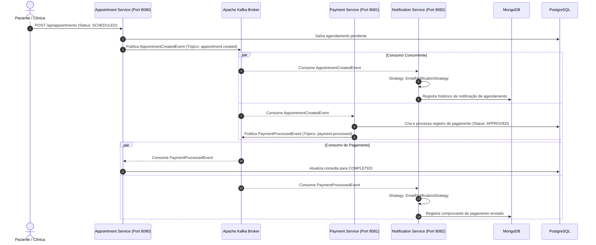

# HealthPay Integration Platform

> Plataforma distribuída e orientada a eventos para agendamento de consultas médicas, processamento assíncrono de pagamentos e notificações multicanal.


---

## 📌 Sobre o Projeto

Em ecossistemas de saúde integrados, a conciliação entre o agendamento de consultas clínicas e a liquidação financeira de pagamentos exige alta disponibilidade, baixa latência e desacoplamento operacional. Falhas no gateway de pagamento ou indisponibilidades temporárias de serviços de notificação não podem impedir ou corromper a criação do registro clínico.

O **HealthPay** resolve esse desafio através de uma arquitetura de **microsserviços orientada a eventos (EDA - Event-Driven Architecture)**, orquestrada por uma **Saga Coreografada** sobre o **Apache Kafka**. O fluxo assegura consistência eventual, rastreabilidade e isolamento de domínios entre agendamento, liquidação financeira e comunicação com o paciente.

---

## 🚀 Funcionalidades Principais

- **Agendamento de Consultas (`appointment-service`)**: Registro e ciclo de vida de consultas médicas (`SCHEDULED`, `COMPLETED`, `CANCELLED`) com persistência relacional.
- **Processamento de Pagamento (`payment-service`)**: Máquina de estados financeira (`PENDING`, `PROCESSING`, `APPROVED`, `FAILED`, `REFUNDED`) com disparo assíncrono de liquidações.
- **Notificações Multicanal (`notification-service`)**: Envio desacoplado de confirmações e recibos via Email (extensível para SMS e Push Notification) utilizando o padrão **Strategy (GoF)** e persistência em NoSQL para auditoria.
- **Saga Coreografada via Kafka**: Comunicação 100% assíncrona orientada a eventos de domínio (`appointmentCreated`, `paymentProcessed`) sem acoplamento entre os serviços.
- **Documentação Viva com Swagger / OpenAPI 3**: Interface interativa para explorar e testar os contratos de API diretamente pelo navegador.
- **Testes Unitários Rápidos e Isolados**: Cobertura de regras de negócio com **JUnit 5 + Mockito** explorando o desacoplamento da Clean Architecture.

---

## 🛠️ Stack Tecnológica

| Componente | Tecnologia | Justificativa |
|---|---|---|
| **Linguagem** | Java 21 LTS | Uso de Records para DTOs imutáveis, Pattern Matching e alta performance. |
| **Framework** | Spring Boot | Produtividade no ecossistema corporativo com injeção de dependências e starters robustos. |
| **Mensageria** | Apache Kafka (KRaft) | Alta vazão, tolerância a falhas e ordenação garantida por partição sem necessidade do ZooKeeper. |
| **Banco Relacional** | PostgreSQL 16 | Garantia ACID para transações financeiras e registros estruturados de agendamento. |
| **Banco NoSQL** | MongoDB 6.0 | Armazenamento semiestruturado flexível de payloads de auditoria e logs de notificação. |
| **Documentação de API** | Springdoc OpenAPI 3 / Swagger UI | Especificação padronizada e interface visual interativa para experimentação de endpoints. |
| **Testes Automatizados** | JUnit 5, Mockito & AssertJ | Testes unitários puros nos Use Cases executados em milissegundos sem dependência de infraestrutura. |
| **Padrões de Projeto** | Clean Architecture, Strategy, Saga | Desacoplamento do domínio em relação a frameworks e extensibilidade do código. |
| **Infraestrutura** | Docker & Docker Compose | Padronização do ambiente de desenvolvimento e deploy conteinerizado da infraestrutura. |

---

## 🏗️ Arquitetura do Sistema

### 1. Fluxo de Eventos (Saga Coreografada)



---

### 2. Design Interno dos Microsserviços (Clean Architecture)

Cada microsserviço é estruturado em camadas concêntricas independentes:

```text
src/main/java/com/healthpay/{service}/
├── domain/                  # Regras de negócio puras, entidades e invariantes de domínio
│   ├── model/               # Entidades de Domínio
│   ├── repository/          # Interfaces (Portas de saída de persistência)
│   └── exception/           # Exceções de negócio
├── application/             # Casos de uso da aplicação (Orquestração)
│   └── usecase/             # Use cases independentes de framework
├── infrastructure/          # Detalhes técnicos, frameworks, banco e mensageria
│   ├── persistence/         # Implementação JPA / Mongo Repositories e Entidades ORM
│   ├── messaging/           # Producers e Consumers Kafka (@KafkaListener)
│   └── config/              # Beans de configuração (Kafka, Database, OpenAPI)
└── presentation/            # Portas de entrada (Controllers REST, DTOs de Request/Response)
    ├── controller/
    └── dto/
```

---

## ⚡ Como Rodar o Projeto Localmente

### Pré-requisitos
- **Java 21 JDK** instalado
- **Maven 3.9+** instalado
- **Docker** e **Docker Compose** rodando

### 1. Subir a Infraestrutura (Bancos e Kafka)

No diretório raiz do repositório, execute:

```bash
docker compose up -d
```

Serviços iniciados:
- **PostgreSQL**: `localhost:5433` (DB: `healthpay`)
- **MongoDB**: `localhost:27017` (DB: `healthpay_notifications`)
- **Apache Kafka (KRaft)**: `localhost:9092`
- **Redis**: `localhost:6379`

---

### 2. Executar os Microsserviços

Abra 3 terminais separados ou execute através da sua IDE preferida:

```bash
# Terminal 1: Appointment Service (Porta 8080)
cd appointment-service
mvn spring-boot:run

# Terminal 2: Payment Service (Porta 8081)
cd payment-service
mvn spring-boot:run

# Terminal 3: Notification Service (Porta 8082)
cd notification-service
mvn spring-boot:run
```

---

### 3. Documentação Interativa (Swagger UI)

Com o `appointment-service` em execução, acesse a interface interativa do Swagger no seu navegador:

🔗 **[http://localhost:8080/swagger-ui.html](http://localhost:8080/swagger-ui.html)**

Pelo Swagger UI, você pode visualizar todos os schemas, exemplos de payloads e executar requisições diretamente com o botão **"Try it out"**.

---

### 4. Testando o Fluxo de Ponta a Ponta via cURL

Envie uma requisição `POST` para criar uma nova consulta:

```bash
curl -X POST http://localhost:8080/api/appointments \
  -H "Content-Type: application/json" \
  -d '{
    "patientId": "11111111-1111-1111-1111-111111111111",
    "doctorId": "22222222-2222-2222-2222-222222222222",
    "appointmentDate": "2026-08-10T14:30:00",
    "amount": 250.00
  }'
```

#### Resposta esperada (HTTP 200 OK):
```json
{
  "id": "3291f9f6-c29f-447e-bc69-97bf04d3aea6",
  "patientId": "11111111-1111-1111-1111-111111111111",
  "doctorId": "22222222-2222-2222-2222-222222222222",
  "appointmentDate": "2026-08-10T14:30:00",
  "amount": 250.00,
  "status": "SCHEDULED"
}
```

Acompanhe os logs dos serviços:
1. O `payment-service` consome o evento, efetiva o pagamento e publica `paymentProcessed`.
2. O `appointment-service` atualiza a consulta para o status `COMPLETED`.
3. O `notification-service` executa as estratégias de notificação e registra os logs de auditoria no MongoDB.

---

## 🧪 Testes Automatizados

A arquitetura desacoplada permite que os Use Cases sejam testados de forma unitária em **milissegundos**, sem necessidade de inicializar o contexto do Spring Boot ou bancos de dados reais.

Para rodar todos os testes automatizados de um microsserviço:

```bash
# Testes do Appointment Service
cd appointment-service
mvn test

# Testes do Payment Service
cd payment-service
mvn test

# Testes do Notification Service
cd notification-service
mvn test
```

### Cobertura dos Testes Unitários:
- **`CreateAppointmentUseCaseTest`**: Criação de consulta, status inicial `SCHEDULED` e emissão do evento no Kafka.
- **`UpdateAppointmentStatusUseCaseTest`**: Transição de estados da consulta e tratamento de exceção quando o registro não é encontrado.
- **`ProcessPaymentUseCaseTest`**: Máquina de estados financeira validando aprovação (`APPROVED` para valores $\le$ R$ 1.000,00) e recusa (`FAILED` para valores $>$ R$ 1.000,00) com inspeção de eventos via `ArgumentCaptor`.
- **`SendNotificationUseCaseTest`**: Resolução dinâmica de estratégias polimórficas (Strategy Pattern) para envio multicanal e validação de canais não suportados.

---

## 💡 Decisões Técnicas e Trade-offs

1. **Saga Coreografada vs. Orquestrada**:
   - *Decisão*: Optou-se pela coreografia de eventos via tópicos dedicados do Kafka.
   - *Trade-off*: Elimina o ponto único de falha de um orquestrador central e reduz a latência de comunicação, garantindo alta coesão e baixo acoplamento entre os serviços.

2. **Desacoplamento de Contratos via Kafka Type Mapping**:
   - *Decisão*: Utilização da propriedade `spring.json.type.mapping` no Spring Kafka em vez de compartilhar uma biblioteca comum com classes Java rígidas.
   - *Trade-off*: Permite que cada microsserviço evolua seu modelo de leitura de eventos de forma independente, evitando acoplamento de classpath binário em nível de código-fonte.

3. **Strategy Pattern para Canais de Notificação**:
   - *Decisão*: Encapsulamento de envio de mensagens sob a interface `NotificationStrategy` com seleção orientada pelo tipo de canal.
   - *Trade-off*: Atende diretamente ao princípio **Open/Closed (SOLID)**, permitindo adicionar novos canais (SMS, WhatsApp, Push) sem modificar os casos de uso existentes.

4. **Persistência Poliglota (PostgreSQL + MongoDB)**:
   - *Decisão*: PostgreSQL para dados transacionais críticos (consultas e pagamentos com garantia ACID) e MongoDB para dados semiestruturados (histórico de notificações e auditoria).
   - *Trade-off*: Otimização de armazenamento e consultas por finalidade de negócio, com o custo de manter duas tecnologias de banco na infraestrutura.

---

## 📂 Estrutura do Repositório

```text
HealthPay/
├── docker-compose.yml             # Orquestração de containers da infraestrutura
├── appointment-service/           # Microsserviço de Agendamento (Port 8080)
├── payment-service/               # Microsserviço de Pagamento (Port 8081)
├── notification-service/          # Microsserviço de Notificações (Port 8082)
├── .github/workflows/ci.yml       # Pipeline CI/CD com GitHub Actions
└── markdowns/                     # Especificações e planejamento técnico
```

---

## 🗺️ Roadmap de Evolução

- [x] Agendamento de consultas com persistência relacional.
- [x] Processamento de pagamentos com máquina de estados.
- [x] Notificações multicanal orientadas ao padrão Strategy.
- [x] Integração completa de mensageria com Apache Kafka em modo KRaft.
- [x] Documentação interativa de API via OpenAPI 3 / Swagger UI.
- [x] Suíte de testes unitários isolados com JUnit 5 e Mockito nos Use Cases.
- [ ] Implementação de Service Discovery e API Gateway com Spring Cloud Gateway.
- [ ] Camada de segurança com autenticação stateless via Spring Security & JWT.
- [ ] Observabilidade distribuída com Prometheus, Grafana e OpenTelemetry (Tracing).
- [ ] Microsserviço de Faturamento (`billing-service`) e integração com convênios (`medical-integration-service`).

---

## 📄 Licença

Este projeto é distribuído sob a licença **MIT**. Consulte o arquivo [LICENSE](LICENSE) para mais detalhes.

---

## 👨‍💻 Autor

Desenvolvido por **Lucas** como projeto de engenharia de software focado em microsserviços modernos, Clean Architecture e sistemas distribuídos com Spring Boot e Apache Kafka.
